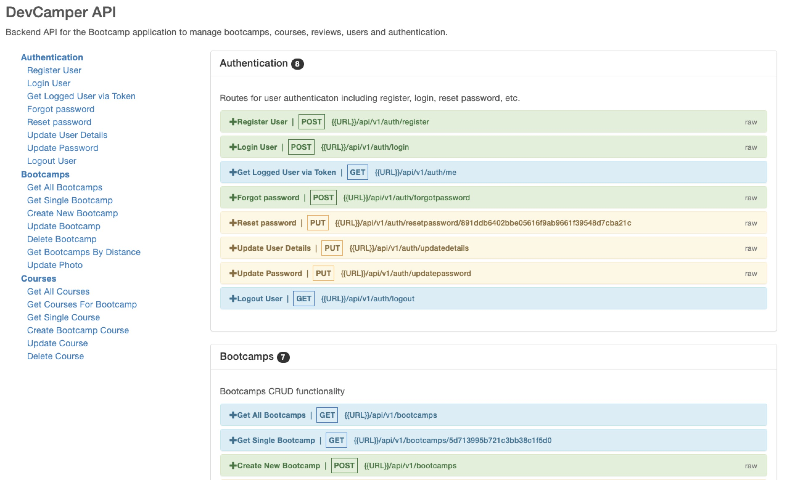
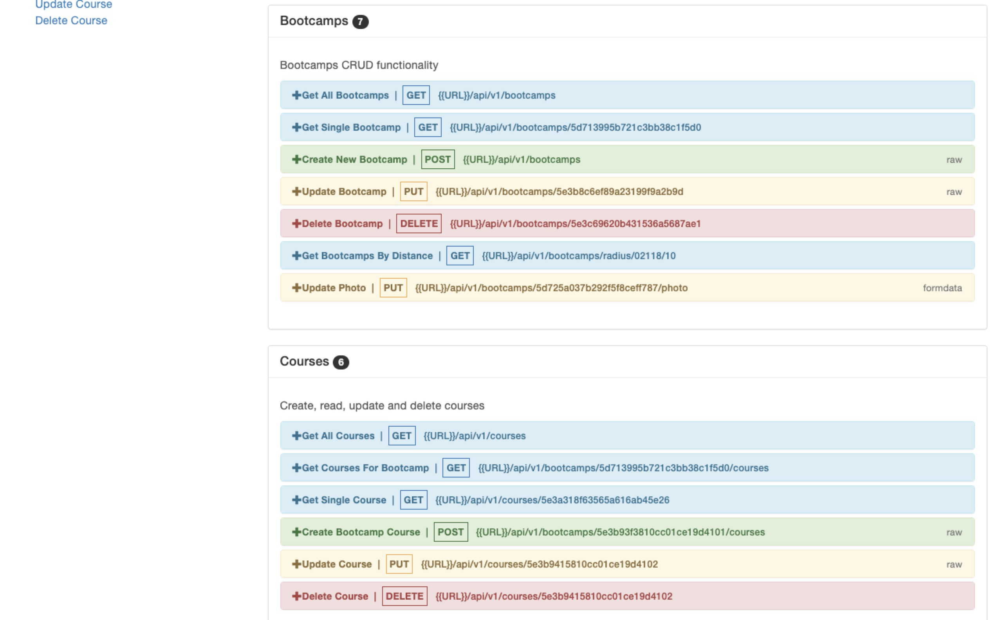
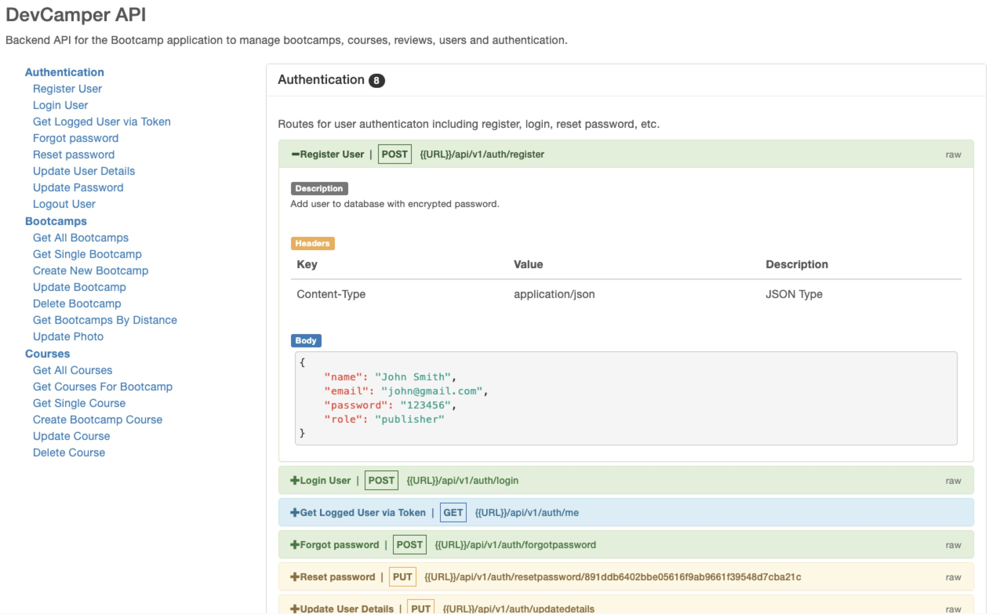

## Bootcamp Website Backend API

> Backend API for the DevCamper application, which is a bootcamp directory website.

### [ Bootcamp API ](101.133.209.120)

## Preview | 预览







## Usage

Rename "config/config.env.env" to "config/config.env" and update the values/settings to your own

## Install Dependencies

```
npm install
```

## Run App

```
# Run n dev mode
npm run dev

# Run in prod mode
npm start
```

- Version 1.0.0
- License: MIT
